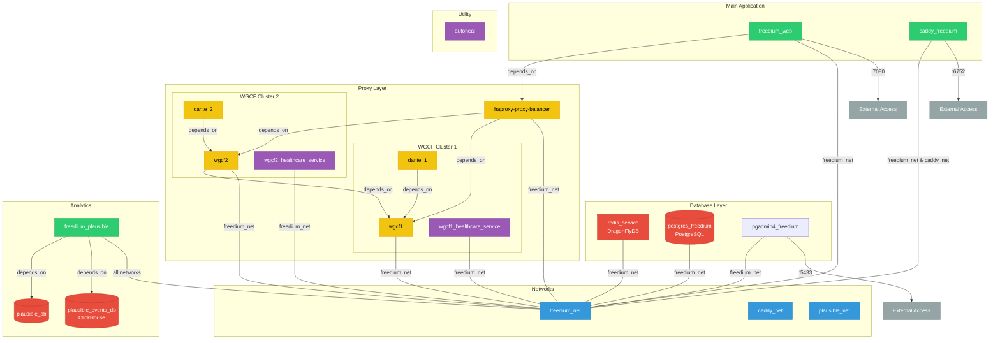

<p align="center"><a href="https://freedium.cfd" target="_blank"></a></p>

<h1 align="center">Freedium: Your paywall breakthrough for Medium!</h1>

<a href="https://www.patreon.com/Freedium">
    
</a>

## Stack:

- Backend:
  - language: Python 3.9+
  - framework: Unicorn, FastAPI
- Frontend:
  - framework: Tailwinds CSS v3, Jinja2
  - monitoring: Sentry
- Database:
  - PostgreSQL, Dragonfly (Redis and Memcached compatible key-value database)
- Utils:
  - Caddy, Docker, Docker Compose, Cloudflare WARP proxy (wgcf)

## Project configuration:

There is three (3) docker-compose profiles:

- `min` - without 2 Cluster of Cloudflare WARP proxy, HAProxy proxy balancer, Plausible, Grafana.
- `local` - based on `min`, but with `freedium.local` exposed hostname, both 80 and 443 ports are exposed, with self-signed TLS certificate.
- `prod` - with all services for production.

### Requirements:

- Docker, Docker Compose, last version is preferred.
- Linux, preferably rolling release. We can't guarantee that Freedium instance will work on other OS. Tested on Ubuntu 22.04 and Fedora 39.
- git
- Preferably, fresh and clean brain.

### Local run:

To configure your Freedium instance, follow these steps:

1. Clone the repository:

   ```
   git clone https://codeberg.org/Freedium-cfd/web/ ./freedium-web --depth 1
   cd ./freedium-web
   ```

2. Create and configure the environment file:

   ```
   cp .env_template .env
   ```

   Open the `.env` file and adjust the values as needed for your setup.

3. (Optional) Set up the Docker network:

   ```
   sudo docker network create caddy_net
   ```

4. Change your hosts file:

   ```
   sudo nano /etc/hosts
   # or
   vim /etc/hosts
   # and when you are closed vim, type `:w !sudo tee %` to save file without executing vim in root mode
   ```

   Add the following line:

   ```
   127.0.0.1 freedium.local
   ```

5. Start the Freedium services (`min` profile):

   ```
   sudo docker compose --profile local -f ./docker-compose/docker-compose.yml up
   ```

   Stopping the services:

   ```
   sudo docker compose --profile local -f ./docker-compose/docker-compose.yml down
   ```

And now you can access local instance of Freedium by opening browser and type `https://freedium.local`. There is would be a warning about insecure connection, because we use self-signed TLS certificate. Ignore it.

### Production run:

All production services are running on `prod` profile. If you use Dockerized reverse proxy, you can specify network `caddy_freedium_net` with `external: true` option in networks section of your reverse proxy container. Specify `caddy_freedium` hostname with port `6752` (or `6753` for Plausible) in your reverse proxy configuration.

As alternative, you can directly change docker-compose configurations to use your reverse proxy. See `docker-compose` and `caddy` folders for more details.

## Architecture:



## TODO:

- ~~Integrate library notifiers - https://github.com/liiight/notifiers~~ Use Graphana and Loki instead
- ~~Do not use 'shturman/dante' image, because it is does not have updates for a long time. (Probably) Use https://hub.docker.com/r/vimagick/dante/~~ Works, don't touch

## Roadmap

- [ ] Speed up parser logic, port to Cython or rewrite to Golang
- [ ] Make parse Medium format directly to Markdown, not HTML, in order to make it more universal. This helps to generate RSS feeds, PDF, HTML.
      OR we need write separate parser for different formats, like PDF, Markdown, etc.
- [ ] Add more services than just a Medium
- [ ] Rewrite frontend to Svelte
- [ ] Move frontend to Cloudflare Pages
- [ ] Integrate Grafana/Prometheus to monitor our services
- [ ] Add more metrics to our services to have ability to monitor it
- [ ] Make able translate posts to different languages using translatepy library
